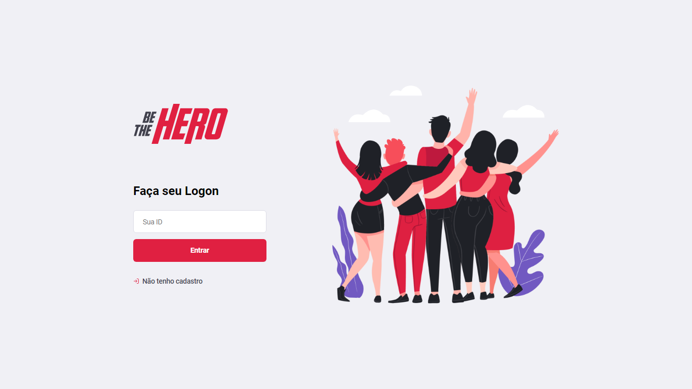

 

 
<h1 align="center">Semana Omnistack 11</h1>

Projeto <strong>Be The Hero</strong> 

  </a>
    <a aria-label="Dias" href="https://rocketseat.com.br/maratonadev/aulas/3.0?aula=1">
    </img>
  </a>
  
  <a aria-label="Repo Size" href="README.md">
  	</img>
  </a>

## 🚀 Projeto

#### O Be The Hero é um projeto para incentivar, encontrar e registrar doadores para Ongs.

## Frontend

#### obs:Pagina de Logon
</img>
